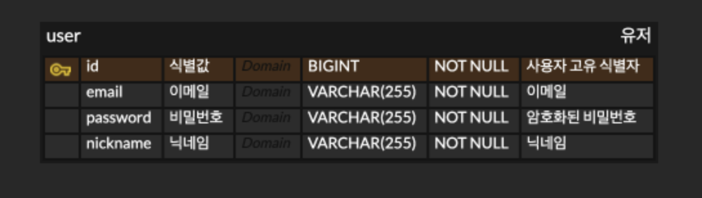
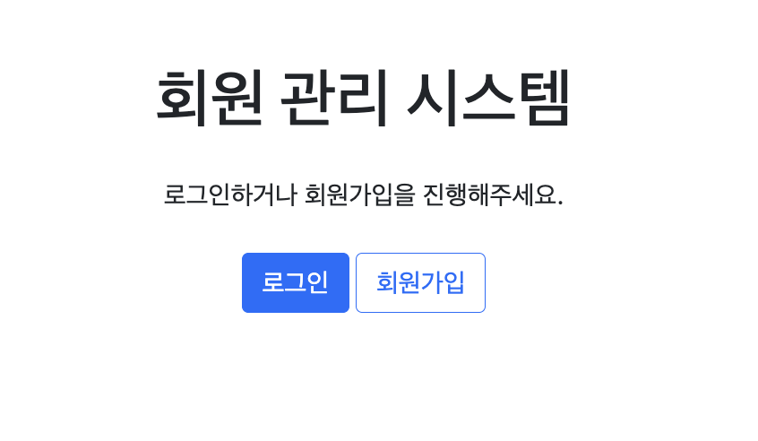
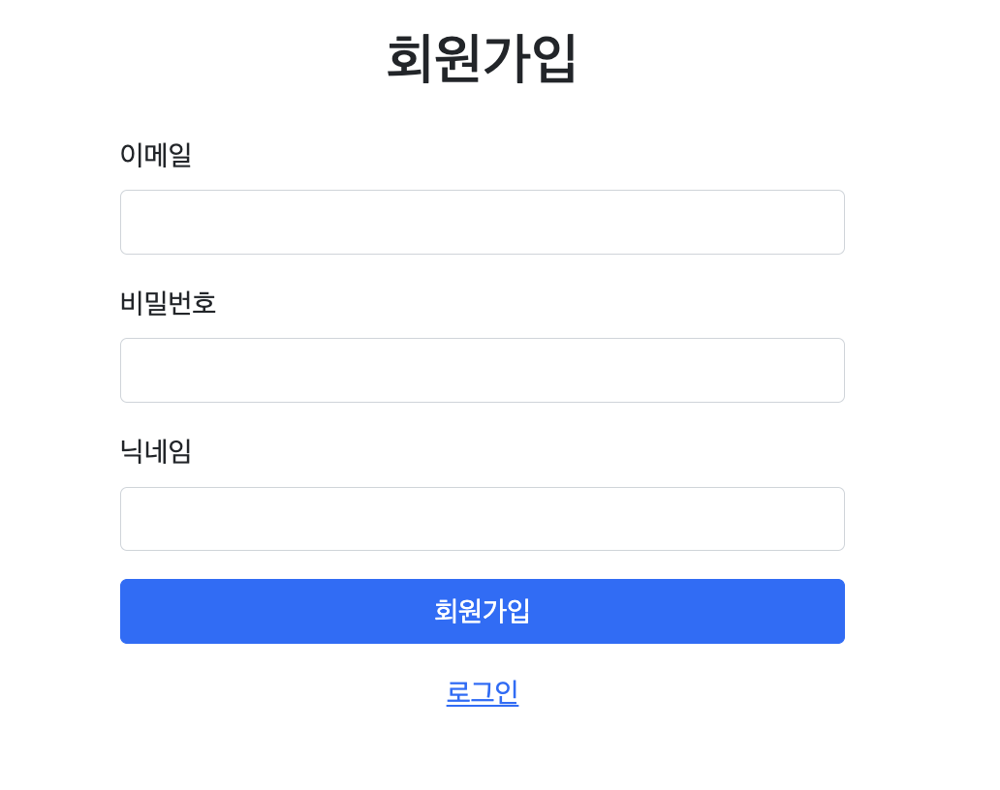
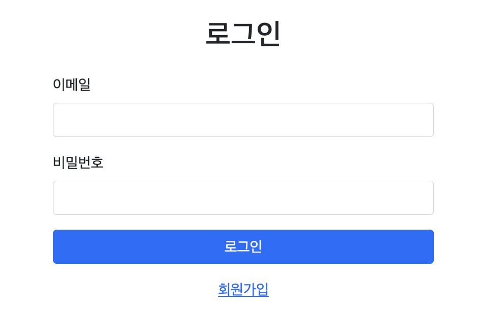
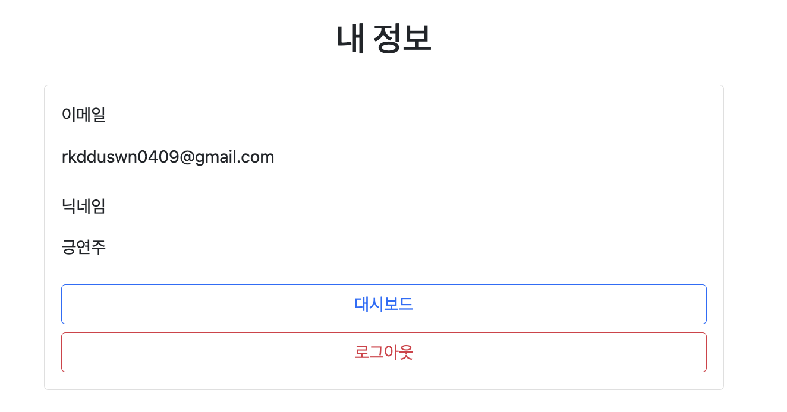

# 회원 관리 시스템

간단한 회원 도메인을 구현한 Spring Boot 프로젝트입니다.

## 🚀 실행 방법


### 1. 로컬 실행

```bash
# Gradle 빌드
./gradlew build
```

### 2. Docker Compose 사용

```bash
# 프로젝트 루트 디렉토리에서 실행
docker-compose up -d
```

애플리케이션이 실행되면 다음 URL에서 접근할 수 있습니다:
- **애플리케이션**: http://localhost:8080
- **MySQL**: localhost:3307
- **Redis**: localhost:6378

## 🚀 사용 방법

1. **회원가입**: `/signup`에서 새 계정 생성
2. **로그인**: `/login`에서 인증
3. **사용자 정보 확인**: 로그인 후 자동으로 `/user-info` 페이지로 이동
4. **대시보드**: 메뉴에서 대시보드로 이동 가능
5. **로그아웃**: 언제든지 로그아웃 가능

## 📊 ERD 


## 🌱 화면 시안




*userInfo에서 로그아웃 버튼을 누르면 로그인 화면으로 이동하여 로그아웃 시안은 제외하였습니다.

## 📋 URL 설명

### 웹 페이지
- **`/`** - 메인 홈페이지
- **`/login`** - 로그인 페이지
- **`/signup`** - 회원가입 페이지
- **`/dashboard`** - 대시보드 페이지
- **`/user-info`** - 사용자 정보 페이지

### API 엔드포인트
- **`POST /signup`** - 회원가입
- **`POST /signin`** - 로그인
- **`GET /users`** - 사용자 정보 조회
- **`DELETE /log-out`** - 로그아웃
- **`POST /reissue`** - 토큰 갱신

## 🏗️ 프로젝트 구조

```
src/main/java/org/example/assignment/
├── AssignmentApplication.java          # 메인 애플리케이션
├── domain/
│   └── user/
│       ├── controller/
│       │   ├── UserController.java     # REST API 컨트롤러
│       │   └── WebController.java      # 웹 페이지 컨트롤러
│       ├── dto/
│       │   ├── request/
│       │   │   ├── SignInRequest.java
│       │   │   └── SignUpRequest.java
│       │   └── response/
│       │       ├── SignInResponse.java
│       │       └── UserInfoResponse.java
│       ├── entity/
│       │   └── User.java               # 사용자 엔티티
│       ├── repository/
│       │   └── UserRepository.java     # JPA 리포지토리
│       └── service/
│           └── UserService.java        # 비즈니스 로직
├── global/
│   ├── exception/                      # 예외 처리
│   │   ├── BizException.java
│   │   ├── ErrorCode.java
│   │   ├── ErrorDescription.java
│   │   ├── ErrorResponse.java
│   │   └── GlobalExceptionHandler.java
│   ├── security/                       # Spring Security 설정
│   │   ├── CustomAuthenticationEntryPoint.java
│   │   ├── JwtFilter.java              # JWT 인증 필터
│   │   └── SecurityConfig.java         # 보안 설정
│   └── util/
│       ├── JwtUtil.java                # JWT 유틸리티
│       └── PasswordEncoder.java        # 비밀번호 암호화
└── infra/
    └── RedisConfig.java                # Redis 설정
```

## 🔐 인증 시스템

### JWT 토큰 기반 인증
- **Access Token**: API 요청 시 사용하는 JWT 토큰
- **Refresh Token**: Access Token 갱신용 토큰 (Redis에 저장)

### 토큰 관리
- **Access Token**: 로컬 스토리지에 저장
- **Refresh Token**: HttpOnly 쿠키에 저장
- **자동 갱신**: Access Token 만료 시 Refresh Token으로 자동 갱신

## 🎨 프론트엔드

### 기술 스택
- **Thymeleaf**: 서버사이드 템플릿 엔진
- **Bootstrap 5**: UI 프레임워크
- **JavaScript**: AJAX API 호출

### 주요 기능
- **회원가입/로그인**: 폼 기반 사용자 인증
- **사용자 정보 조회**: JWT 토큰 기반 API 호출
- **자동 리다이렉트**: 인증 상태에 따른 페이지 이동
- **에러 처리**: 사용자 친화적인 에러 메시지